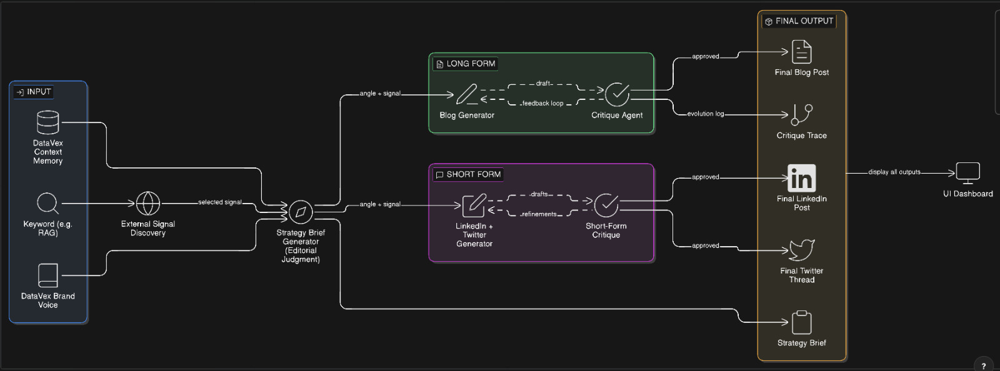

#  Growth Intelligence Engine — DataVex

An autonomous, keyword-driven growth system that converts real-world internet signals into high-authority, publish-ready content assets for **DataVex**.

This project operationalizes **information arbitrage**:
Find emerging technical signals → select a strategic angle → generate multi-platform content → refine through critique loops → ship authority.

---

# 🧠 System Overview


The engine follows a structured editorial pipeline:

## 1️⃣ Input Layer
- **Keyword** (provided by organizer)
- **DataVex Context Memory**
- **Brand Voice Guide**

These define constraints, tone, and positioning.

---

## 2️⃣ External Signal Discovery
The system:
- Searches for a real article, research paper, funding announcement, outage, or competitor move
- Selects a relevant signal tied to the keyword
- Filters noise
- Outputs a selected signal

Goal: Identify leverage, not trends.

---

## 3️⃣ Strategy Brief Generator (Editorial Judgment Layer)

Before writing content, the system produces a **Strategy Brief**:

Includes:
- Signal summary
- Chosen strategic angle
- Rejected angles (with reasoning)
- Platform distribution plan
- Core positioning thesis

This ensures thinking precedes writing.

---

# ✍️ Content Generation Layer

The engine splits into two tracks:

---

## 🟢 Long Form (Blog)

**Flow:**
Angle + Signal → Blog Generator → Critique Agent → Refinement Loop → Final Blog

Outputs:
- 800–1200 word SEO-structured blog post
- Technical deep dive
- Problem-first positioning
- Data-backed narrative

The critique agent improves:
- Hook strength
- Clarity
- Authority tone
- Differentiation
- Logical structure

---

## 🟣 Short Form (LinkedIn + Twitter/X)

**Flow:**
Angle + Signal → Short-Form Generator → Short-Form Critique → Refinement → Final Assets

Outputs:
- LinkedIn Post (200–300 words)
- Twitter/X Thread (5–8 tweets)

Optimized for:
- Platform-native structure
- Hook density
- Engagement triggers
- Shareability

---

# 🔁 Critique Loop (Core Differentiator)

Each content asset follows:

Draft 1  
→ Critique 1  
→ Draft 2  
→ Critique 2  
→ Final Version  

Critiques address:
- Generic hooks
- Sales-heavy tone
- Weak differentiation
- Lack of data
- Platform mismatch
- Structural inefficiencies

An evolution log is generated for transparency.

---

# 📦 Final Outputs

- ✅ Strategy Brief
- ✅ Final Blog Post
- ✅ Final LinkedIn Post
- ✅ Final Twitter Thread
- ✅ Critique Trace (Draft Evolution)
- ✅ UI Dashboard View (aggregated outputs)

---

# 🏗 Architecture Summary
Keyword + Brand Voice + Context
↓
External Signal Discovery
↓
Strategy Brief Generator
↓
┌───────────────┬───────────────┐
│ Long Form     │ Short Form    │
│ Blog Engine   │ LinkedIn/X    │
│ + Critique    │ + Critique    │
└───────────────┴───────────────┘
↓
Final Outputs + Critique Trace
↓
UI Dashboard


---

# 🎯 Why This Matters

Most growth systems produce content.

This engine produces:
- Strategic positioning
- Signal-backed authority
- Platform-native distribution
- Measurable refinement

It transforms growth from creative guessing into a repeatable, judgment-driven pipeline.

---

# 🧩 How To Use (When Organizer Provides Keyword)

1. Insert keyword
2. Run signal discovery
3. Review auto-generated strategy brief
4. Generate long-form + short-form drafts
5. Review critique trace
6. Export final assets

---

# 🔮 Potential Extensions

- Live RSS + arXiv ingestion
- Competitor monitoring automation
- Auto-publishing integrations
- Performance feedback loops
- SEO optimization layer
- Trend velocity scoring

---

# 🏁 One-Line Summary

Keyword → Real Signal → Strategic Angle → Multi-Platform Content → Iterative Critique → Publish-Ready Authority

---

# 🚀 Setup & Run

## Prerequisites

- Python 3.11+
- Node.js 18+
- Google API key (Gemini / Google AI Studio)

## Backend

```bash
cd backend
python3 -m venv .venv
source .venv/bin/activate   # Windows: .venv\Scripts\activate
pip install -r requirements.txt
cp .env.example .env
# Edit .env: set GOOGLE_API_KEY=... (from Google AI Studio)
```

Optional: set `LLM_STRATEGY` and `LLM_CONTENT` for different Gemini models (e.g. `gemini-2.0-flash`, `gemini-2.5-pro`).

```bash
# From backend directory, with PYTHONPATH including backend
export PYTHONPATH="${PYTHONPATH}:$(pwd)"
uvicorn main:app --reload --host 0.0.0.0 --port 8000
```

API docs: http://localhost:8000/docs

## Frontend

```bash
cd frontend
npm install
cp .env.example .env.local
# Set NEXT_PUBLIC_API_URL=http://localhost:8000 (or your backend URL)
npm run dev
```

Dashboard: http://localhost:3000

## Sample run

1. Open the dashboard.
2. Enter keyword **RAG**.
3. Click **Run pipeline**. Wait for the pipeline to finish (1–2 min typical).
4. Review signal, strategy brief, chosen/rejected angles, final content, and critique evolution.

---

# 🌐 Deployment

## Backend (Render)

- New Web Service.
- Root directory: `backend` (or set build command to run from repo root with `cd backend && ...`).
- Build: `pip install -r requirements.txt`
- Start: `uvicorn main:app --host 0.0.0.0 --port $PORT`
- Env: `GOOGLE_API_KEY` (required). Optionally `LLM_STRATEGY`, `LLM_CONTENT`, `SIGNAL_CONFIDENCE_THRESHOLD`.

Render runs from a single directory; if the repo root is used, set **Root Directory** to `backend` in the Render dashboard.

## Frontend (Vercel)

- Import the repo; framework preset: Next.js.
- Root directory: `frontend`.
- Env: `NEXT_PUBLIC_API_URL` = your Render backend URL (e.g. `https://your-app.onrender.com`).

After deploy, open the Vercel URL and run a keyword to verify end-to-end.

---

# 📁 Repo structure

```
backend/
  agents/          signal, strategy, positioning, long_form, short_form, critique, orchestration
  config/          settings (env)
  memory/          Chroma + DataVex corpus loading
  api/              FastAPI routes
  utils/            schemas, logging
  data/             datavex_corpus (markdown), signal_cache.json
frontend/
  app/              Next.js App Router pages
  components/       dashboard UI
  services/         API client
docs/
  architecture.md   data flow and stack
  demo_script.md    ≤2 min judge demo
  decisions.md      design rationale
```
